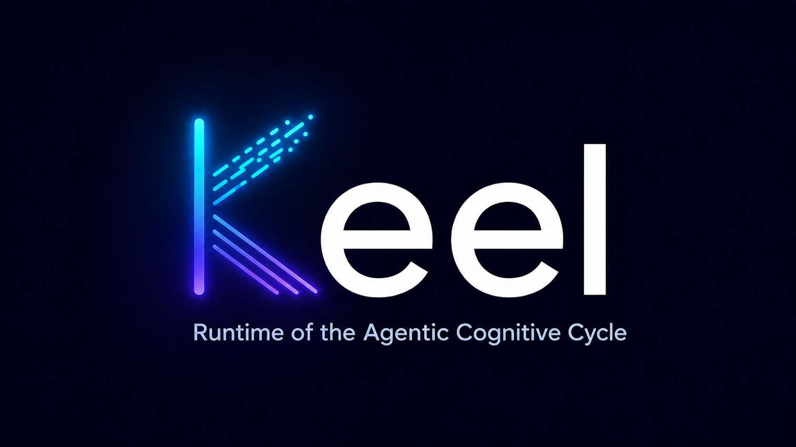

<p align="center"></p>

# Keel — Runtime of the Agentic Cognitive Cycle

> **Having a rule available does not guarantee it gets applied.**

Keel is a runtime that compiles declarative engineering constraints (YAML,
Kubernetes-style `apiVersion/kind/metadata/spec`) into an **immutable
snapshot**, and evaluates the events of an LLM agent session against it —
outside the model. The model never reads configuration: it only ever receives
verdicts, at the exact turn where they apply.

Full specification: [`docs/RCCA_reference_architecture_v0_9_1_EN.md`](docs/RCCA_reference_architecture_v0_9_1_EN.md)
(Spanish version available in `docs/`). Deferred organizational-scale material:
[`docs/RCCA_future_EN.md`](docs/RCCA_future_EN.md).

**Docs index:**
- [`STATUS.md`](STATUS.md) — point-by-point conformance map (invariants, sections, ADRs).
- [`docs/INSTALL.md`](docs/INSTALL.md) — install / data-preserving uninstall.
- [`docs/FUNCIONAMIENTO_INTERNO.md`](docs/FUNCIONAMIENTO_INTERNO.md) — how it works (the three layers, agents vs skills).
- [`docs/PARCIALES.md`](docs/PARCIALES.md) — every partial by state; nothing hidden.
- [`docs/INVENTARIO.md`](docs/INVENTARIO.md) — what's left, grouped by precondition.
- [`docs/PHASE2_INITIATIVE.md`](docs/PHASE2_INITIATIVE.md) — the deferred Phase-2 units (planned, not started).
- [`docs/DOCTRINA.md`](docs/DOCTRINA.md) — cold tools before AI (0 tokens).
- [`docs/PLAN_PRUEBAS.md`](docs/PLAN_PRUEBAS.md) — living test checklist.
- [`docs/ROADMAP.md`](docs/ROADMAP.md) · [`docs/PROGRAMA_DE_TRABAJO.md`](docs/PROGRAMA_DE_TRABAJO.md) — roadmap + task-by-task backlog.

## Why

LLM-assisted environments scatter their rules across instruction files,
skills, hooks, linters and CI — and compliance is probabilistic: it depends on
the model deciding to look. Constraints are the only class of engineering
knowledge still delivered as prose whose failure mode is **silent rot**:
nothing tells you whether a rule is still valid or whether anyone follows it.

Keel gives constraints the same jump that tests gave documentation: from prose
that lies silently to a check that fires or breaks loudly.

## What Keel does — the three layers that hold the project up

Keel intervenes at the three moments the spec defines (section 5.3, section 11.4, section 6.2):

- **L1 — pre-execution gate (`keel gate`).** Before an irreversible action runs
  (a `DROP DATABASE`, a destructive command), Keel validates it and — if it
  breaks a rule — **blocks it before it becomes a process** (exit 2 +
  contextualized reason). This is the inner ring (section 5.3): a blocked command
  never executes. It is wired as a client hook (Claude Code PreToolUse); the
  hook only transports, the rules live in the runtime.
- **L2 — cognitive activation.** When a governed concept surfaces, the rule can
  load a **skill**: Keel delivers the compact guidance (with a rejected/accepted
  exemplar) once per session, references it thereafter, and escalates to the
  full guide only if the agent keeps tripping on it (oscillation, section 6.5).
- **L3 — post-action verification.** After an edit, feedback for correction;
  at completion, a gate that refuses to close a session with live blockers
  (section 12.3); and an independent **auditor agent** (section 14) that can run on a
  different model, whose opinion is filed as `semantic` — advisory, never a
  block of an irreversible action (section 4.7).

Underneath all three, the **Evidence Ledger** (the first product, ADR-021)
records every evaluation with *how* it was known (`deterministic | semantic |
attestation | human`, never mixed) and both the **declared** and **effective**
decision — so telemetry answers which constraints are alive, dead, or
mis-specified, and the Phase 0c enforcement experiment can be measured.

**Two modes, one engine:** `keel observe` is passive (records, never blocks —
telemetry); `keel gate` enforces (the keel holds). See `STATUS.md` for the
point-by-point conformance map and what is still deferred (composition
monotonicity, lock/CI plane, control plane).

## Layout

```
crates/
├── keel-core      # stable vocabulary: Verdict, Decision lattice (section 7.4-D3),
│                  # ContentHash (the ONLY canonical hashing authority, inv. 9)
├── keel-dsl       # authoring vocabulary: envelope + kinds + JSON Schema
├── keel-engine    # compiler, snapshot, tool runner, ledger, passive runtime
│                  # (forbidden edges enforced by tests/arch_boundaries.rs)
└── keel-cli       # the `keel` binary — orchestration only, no logic
schemas/           # versioned JSON Schemas (the Phase 0a deliverable)
examples/workspace # runnable demo: the spec section 11.4 gates with stub tools
```

Forbidden dependency edges (the trust model, compiled):
`compiler ⇏ runtime` · `runtime ⇏ dsl` · `snapshot ⇏ dsl` · `ledger ⇏ runtime`.

## Quickstart

```bash
cargo build --workspace

# create your workspace (structure only — YOUR rules, no defaults)
keel workspace init ~/my-keel-workspace
cd ~/my-keel-workspace
#   write rules in rules/   (template: rules/rule.yaml.example)
#   declare tools in tools/ (template: tools/tool.yaml.example)
#   add tests in tests/     (template: tests/test.yaml.example)

keel compile                       # atomic: staging → RuleTests → publish
keel observe --events events.jsonl # passive evaluation → ledger (nothing blocks)
keel explain <ev_id>               # full traceability for one evidence entry
keel prune                         # lifecycle proposals backed by data (section 7.7)
keel test                          # run RuleTests against a staged snapshot
keel doctor                        # end-to-end read-only health checks

# wire the client — keel edits the settings.json itself (merge-safe, portable):
keel adapter claude-code --install --global   # governs sessions from anywhere
#   keel adapter claude-code --install         # …or just this project's .claude/
#   keel adapter claude-code --uninstall       # remove keel's hook (leaves the rest)
```

Install & uninstall in depth (data-preserving): [`docs/INSTALL.md`](docs/INSTALL.md).

Or try the runnable demo of the spec's own gates:

```bash
cd examples/workspace
keel compile && keel observe --events fixtures/events.jsonl
```

## Writing a rule

The rule **declares**; the tool **implements** — and the tool is code
(a script, binary or wrapped analyzer returning `valid|invalid|unknown`;
0 tokens, deterministic). No rule compiles without `author`, `adrRef` and
`reviewAfter` (ADR-023): every constraint has an owner, an originating
decision, and a review window so `keel prune` can later propose deleting it
**with data, not courage**.

```yaml
apiVersion: keel/v1alpha1
kind: Rule
metadata:
  id: my-project.no-raw-queries
  author: you
  adrRef: adr:ADR-031
  reviewAfter: P6M
spec:
  reversibility: reversible
  on: [file.edited]
  detect:   { using: "builtin:text.regex", with: { pattern: "->query\\(" } }
  validate: { using: "tool:my-analyzer" }
  enforcement:
    invalid: { decision: block, report: { message: "use the query builder" } }
    valid:   { decision: allow }
```

## Honesty notes

- The local plane is **cooperative**: it does not resist a determined
  developer. `locked` becomes a guarantee only on the compliance plane (CI) —
  see spec section 5. No output of this tool claims otherwise.
- Irreversible actions: `unknown` escalates to a **human**, never to a model
  (section 4.7, ADR-017). The compiler normalizes this floor.
- Findings are SARIF (ADR-016); evidence entries carry their origin class
  (`deterministic | semantic | attestation | human`) and the classes are
  never mixed (section 6.4).

## License

The whole repository — code (`crates/`, `schemas/`, `examples/`) and the
specification (`docs/`) — is licensed under the [Apache License 2.0](LICENSE):
one license, corporate-friendly, with an explicit patent grant. Redistributions
must keep the [`NOTICE`](NOTICE).

- **Name** — "Keel" is a trademark of JhonaCodes; the code license does not
  grant rights to the name (see [`TRADEMARK.md`](TRADEMARK.md)).

Copyright 2026 JhonaCodes. This is the open core: the local runtime, CLI,
adapters, ledger and specification. Organizational-scale components (Control
Plane, signed catalog, web panel — `docs/RCCA_future.md`) are intentionally
out of this repository.
