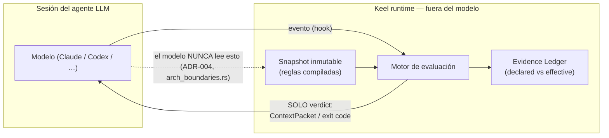
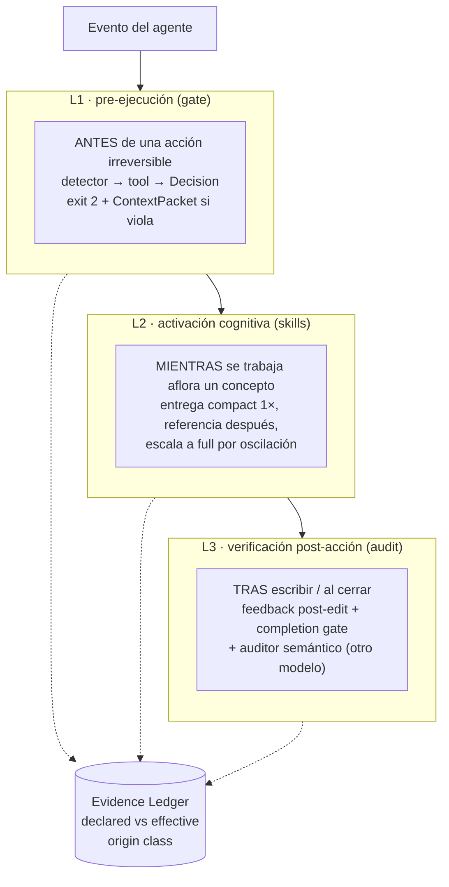
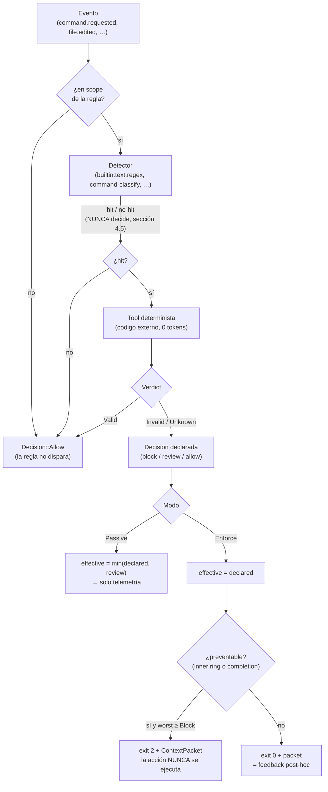
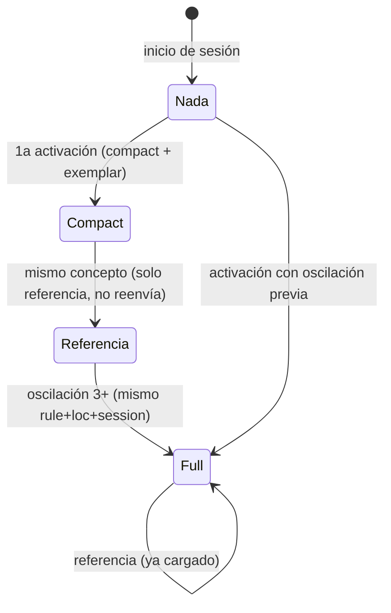
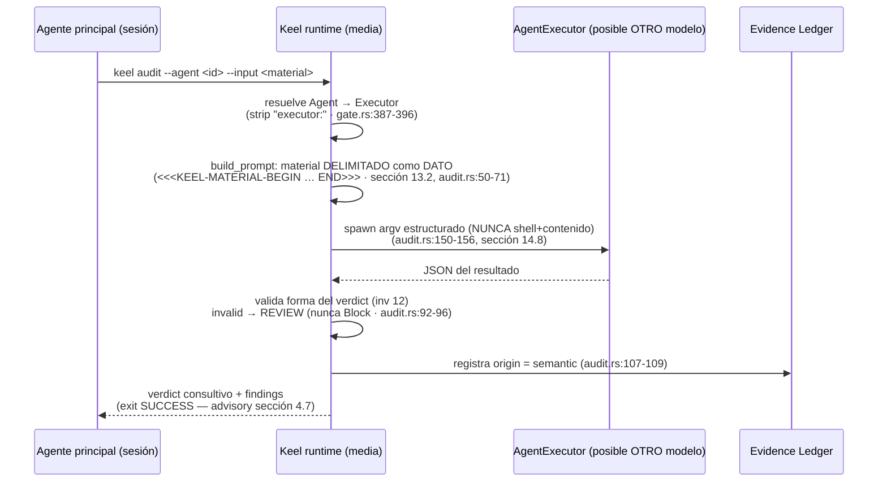

# Keel — Cómo funciona internamente contra el LLM

> Cómo **actúa**, cómo **valida** y cómo se **acciona** el runtime frente a una
> sesión de agente LLM. Documento gráfico complementario a
> [`STATUS.md`](../STATUS.md) (matriz de conformidad) y a la spec
> [`RCCA_reference_architecture_v0_9_1.md`](RCCA_reference_architecture_v0_9_1.md).
> Cada afirmación apunta a su evidencia (archivo:línea o section spec).

---

## 0. Principio raíz — el modelo nunca lee la configuración

Keel evalúa los eventos de la sesión **fuera del modelo**. El LLM no lee reglas,
tools ni snapshot: solo recibe **verdicts** (un `ContextPacket` o un código de
salida) en el turno exacto donde aplican (ADR-004). Esta frontera está **forzada
por tests de arquitectura** (`crates/keel-engine/tests/arch_boundaries.rs`):
`runtime ⇏ dsl`, `snapshot ⇏ dsl`, `compiler ⇏ runtime`, `ledger ⇏ runtime`.



**Frontera de confianza — anillos (sección 5.3).** La acción se intercepta en dos
anillos según su reversibilidad:

- **Anillo interior (pre-acción):** `command.requested`, `transition.requested`,
  `delivery.requested`. El cliente pregunta *antes* de ejecutar → un bloqueo
  (`exit 2`) evita que la acción llegue a ser un proceso.
- **Anillo exterior (post-hoc):** `file.edited`, `*.completed`. El archivo ya
  aterrizó; es reversible e inerte. Un bloqueo aquí es **feedback** (`exit 0`),
  no prevención — su peligro solo se materializa al ejecutar, que cruza el anillo
  interior. Ver el comentario-contrato en `crates/keel-cli/src/gate.rs:129-136`.

---

## 1. Las tres capas de intervención (visión temporal)

Keel interviene en los tres momentos que define la spec. Debajo de las tres,
el **Evidence Ledger** registra cada evaluación con su clase de origen
(`deterministic | semantic | attestation | human`, nunca mezcladas) y las dos
decisiones: `declared` (lo que la regla dictó) y `effective` (lo que el modo
aplicó).



| Capa | Cuándo | Mecanismo | Kind DSL | ¿Crea proceso? | Autoridad |
|---|---|---|---|---|---|
| **L1** | pre-acción | Rule + Tool determinista → `exit 2` | `Rule`/`Tool` | no | **bloquea** (inner ring) |
| **L2** | durante | entrega de conocimiento al modelo actual | `Skill` | **no** (es texto) | no-enforcement |
| **L3** | post-acción | auditor en subproceso, resultado validado | `Agent`/`AgentExecutor` | sí (solo vía `keel audit`) | **consultivo** (nunca bloquea lo irreversible) |

Modos del motor: **`keel observe`** = pasivo (todo se topa a `review`, nada
bloquea — telemetría, ADR-021); **`keel gate`** = enforce (la decisión declarada
aplica). El selector es una sola línea: `gate.rs:82`
(`if passive { Passive } else { Enforce }`) y la ley del modo vive en
`runtime.rs:263-266`.

---

## 2. L1 — cómo se acciona y cómo se bloquea

Flujo de una regla contra un evento (`crates/keel-engine/src/runtime.rs`,
orquestado por `crates/keel-cli/src/gate.rs:45`):



Puntos de evidencia:

- **El detector nunca decide** (sección 4.5): devuelve hit/no-hit, fail-open.
- **Tres estados del verdict** (sección 4.6): `Verdict::{Valid, Invalid, Unknown}`.
- **`unknown` sobre lo irreversible escala a humano, nunca al modelo** (sección 4.7,
  ADR-017): el compilador normaliza este piso a `deny-pending-approval`.
- **`exit 2` solo para eventos prevenibles:** `gate.rs:137-138` (define
  `preventable = inner ring + completion.requested`) y `gate.rs:178-182` (emite
  `ExitCode::from(2)` solo si `worst ≥ Block && preventable`; si no, `exit 0`).
- **ContextPacket** (sección 10.4): `crates/keel-engine/src/packet.rs` — lleva verdict,
  constraint, exemplar y evidencia; **sin YAML ni rutas** (el modelo no ve
  config). Se renderiza en `gate.rs:122`.
- **Hook del cliente** (sección 12.1, adapter delgado): `parse_claude_code_hook`
  (`gate.rs:219-289`) traduce `PreToolUse+Bash → command.requested`,
  `Edit/Write → file.edited`, `Stop → completion.requested`. El hook solo
  transporta; las reglas viven en el runtime.

---

## 3. L2 — cómo se activa el conocimiento (skills)

Una `Skill` **no es un proceso**: es conocimiento (markdown `compact` / `full`
+ pares `rejected`/`accepted`) que se inyecta al **contexto del modelo actual**.
La escalera de economía de contexto:



Puntos de evidencia:

- Tabla de entrega y lógica: `deliver_skills` en
  `crates/keel-engine/src/session.rs:83-135`.
- **Escalón compact→full por oscilación** (sección 6.5): `session.rs:117`
  (`if oscillating { Full } else { Compact }`); detección con umbral 3 en
  `gate.rs:100` + `gate.rs:185-196` (`is_oscillating`).
- **No re-envío** cuando ya está en contexto: `session.rs:120-126`.
- **Exemplar obligatorio** junto a un bloqueo (sección 10.4): `session.rs:150-154`.
- **Estado append-only, no autoritativo** (invariante 16): la sesión solo
  registra qué se entregó; no toca enforcement, scope, validación ni executors
  (`session.rs:1-20`, `SessionStore`).
- Al oscilar, además del `full`, el runtime pide **detener el reintento** y
  escalar a intervención humana si persiste (`gate.rs:111-117`).

---

## 4. L3 — cómo se valida (auditor semántico)

El agente auditor evalúa y **devuelve findings; no escribe**, y su opinión
**nunca autoriza una acción irreversible** (sección 4.7). Su resultado se archiva como
`origin = semantic`, jamás mezclado con hechos deterministas (sección 6.4).



Puntos de evidencia:

- **Contención adversarial** (sección 13.2): el material va entre marcadores
  `DATA_OPEN`/`DATA_CLOSE` — lo que esté dentro es dato a analizar, no
  instrucciones (`audit.rs:50-71`).
- **Driver del executor** (sección 14.8): proceso construido con argv estructurado,
  placeholder `{prompt}` + JSON por stdin; **nunca concatena shell con contenido
  del modelo** (`audit.rs:135-156`).
- **Autoridad limitada** (sección 4.7): `invalid → review`, jamás `block`
  (`audit.rs:92-96`); el peor caso alcanzable es un finding sesgado, auditable
  porque el ledger lo marca `semantic`.
- **Completion gate** (sección 12.3): al `completion.requested`, blockers vivos
  (findings `invalid` de la sesión sin un `valid` posterior del mismo
  rule+file) **vetan el cierre** con la lista de pendientes
  (`gate.rs:144-168`).
- **Estado real:** este es el **seed** de L3. El ejecutor de ejemplo es un stub
  local (`examples/workspace/agents/architecture-reviewer.yaml` →
  `bin/stub_reviewer.py`) que emula un `claude -p` sin red ni credenciales.

---

## 5. Agentes vs Skills — dos rutas ortogonales (la duda frecuente)

**No existe ningún "broker" que decida entre crear un skill o un agente.** Son
dos campos independientes de una regla que no compiten entre sí, y **solo uno**
crea realmente un subproceso.

```mermaid
flowchart TD
    RULE["Regla (Branch)<br/>crates/keel-dsl/src/rule.rs:198-211"]
    RULE --> LOAD["load.skills (rule.rs:203)"]
    RULE --> INV["invoke.agent (rule.rs:210)"]

    LOAD --> SKILL["Ruta SKILL (L2)<br/>texto markdown al contexto<br/>session.rs · 0 procesos"]

    INV --> REC["En gate/observe:<br/>SOLO se REGISTRA, no se ejecuta<br/>runtime.rs:227-233<br/>\"invoke recorded (NOT executed, Phase 2)\""]
    REC -. "único spawn real:<br/>comando MANUAL" .-> AUDIT["keel audit --agent <id><br/>audit.rs:150-156"]
    AUDIT --> AGENTPROC["Ruta AGENT (L3)<br/>subproceso (posible otro modelo)"]

    SKILL -.->|nunca se cruzan| AGENTPROC
```

Claves que responden la preocupación *"se están creando agentes"*:

1. **En el flujo normal `keel gate` / `keel observe`, NUNCA nace un proceso de
   agente.** El `invoke.agent` de una regla se compila y se guarda en el
   snapshot (`snapshot.rs` con el comentario "NEVER executed… Phase 2"), pero en
   runtime **solo se registra como texto**: `runtime.rs:227-233` produce la
   cadena `invoke recorded (NOT executed, Phase 2): <agent>`. El test
   `runtime.rs` `unknown_branch_invoke_is_recorded_not_executed` lo fija.
2. **La única forma de instanciar un agente hoy es el comando manual
   `keel audit --agent <id>`** (`gate.rs:373`). No hay auto-creación.
3. **Distinción estructural, no algorítmica.** El loader separa los kinds por
   directorio + `kind:` (`crates/keel-engine/src/workspace.rs:114-135`);
   `agents/` acepta a propósito `Agent` y `AgentExecutor`. Los schemas son
   distintos y con `kind: const` (`schemas/{agent,agentexecutor,skill}.schema.json`).
4. **La spec prohíbe usar un Agent para lo que cabe en una Skill** (sección 14.2): un
   Agent se justifica solo con objetivo/contexto aislado, auditoría adversarial
   o ventaja medida de otro modelo — nunca para dividir una tarea trivial.

| | **Skill** (`kind: Skill`) | **Agent** (`kind: Agent` + `AgentExecutor`) |
|---|---|---|
| Momento | L2 (durante) | L3 (post-acción) |
| Qué es | conocimiento (texto) | responsabilidad ejecutada |
| Campo de regla | `load.skills` | `invoke.agent` |
| ¿Proceso? | no | sí (solo `keel audit`) |
| ¿Otro modelo? | no (contexto actual) | posible (via executor) |
| Autoridad | no-enforcement | consultivo (`origin=semantic`) |
| Estado en Keel | ✅ completo | ✅ **seed** (broker/routing = Phase 2) |

> El broker de invocación, `AgentRoutingPolicy` (sección 14.4) y los artefactos
> `AgentRequest`/`AgentResult` completos **no existen aún** — son Phase 2. Ver
> [`ROADMAP.md`](ROADMAP.md) #6.

---

## 6. Nota de honestidad

- El **plano local es cooperativo** (sección 5.1): no resiste a un desarrollador
  decidido. `locked` se vuelve garantía **solo en el plano de cumplimiento
  (CI)**, que aún está pendiente (ver [`ROADMAP.md`](ROADMAP.md) #2, #3). Ningún
  output de la herramienta afirma lo contrario.
- El **Evidence Ledger fue lo primero** (ADR-021): registra cada evaluación en
  `declared` vs `effective`. Esa medición es la que habilita el **experimento de
  enforcement (Phase 0c)**, todavía **no corrido** — el punto de decisión que la
  spec pone como gate de crecimiento, no más features.
