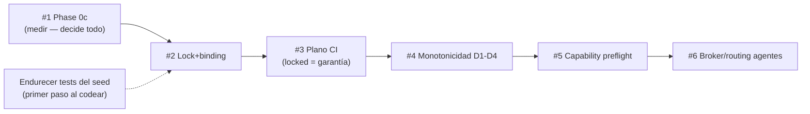

# Keel — Roadmap de lo faltante

> Hoja de ruta accionable de lo pendiente, en el **orden que impone la spec**.
> Complementa a [`STATUS.md`](../STATUS.md) (matriz de conformidad punto a punto)
> y a [`FUNCIONAMIENTO_INTERNO.md`](FUNCIONAMIENTO_INTERNO.md) (cómo funciona hoy).
> Cada ítem cita su evidencia. Estado hoy: 3 capas de intervención en modo
> **seed**, 4 crates, 61 tests verdes; el auto-diagnóstico de `STATUS.md`
> coincide con el código verificado.

Leyenda: ❌ falta · 🟡 parcial · ⏭ diferido por la propia spec (fuera de alcance
del núcleo actual, **no** es deuda).

---

## Prioridad según la spec (el orden importa)

### 1 · Phase 0c — experimento de enforcement  · ❌  · GATE DE CRECIMIENTO
**Qué:** medir violaciones-que-llegan-a-revisión-humana **con** vs **sin**
`keel gate`, sobre N tareas reales, mismo modelo/cliente/reglas, contra una línea
base honesta (instrucciones + skills + linters).
**Por qué importa:** es el **punto de decisión**, no una feature. La spec
condiciona las Fases 2+ a un delta material y sostenido. Es medición, no código.
**Evidencia:** `STATUS.md:133` (❌ not run); spec sección 15.1
(`RCCA_reference_architecture_v0_9_1.md:1555-1562`). La infraestructura que lo
mide ya existe: `declared` vs `effective` en el ledger
(`crates/keel-engine/src/ledger.rs`, `runtime.rs:248-251`).
**Hecho cuando:** hay un dataset de sesiones reales y un reporte con el delta
medido y su criterio de continuación.

### 2 · Lock + binding (inv 4 / inv 9)  · ✅ HECHO  · CÓDIGO
**Qué:** `.keel/project.yaml` (binding del repo) + `keel.lock` (hash canónico
fijado), con la ceremonia de generación/validación.
**Por qué importa:** sin esto no existe el plano CI y `locked` **no llega a ser
garantía**. El repo debe contener solo binding/lock/CI, no estado local.
**Evidencia:** `STATUS.md:47,52,85`; spec sección 8.6, ADR-007. Hoy solo hay autoridad
de hash única (`crates/keel-engine/src/hash.rs`), sin fichero lock.
**Hecho cuando:** `keel` genera y valida el lock, y local + CI comparten el mismo
hash/lock (inv 9).

### 3 · Plano CI / cumplimiento  · ✅ HECHO  · CÓDIGO + INFRA
**Qué:** el mismo engine corriendo en CI (runtime efímero, resuelve capabilities
por configuración), que falla el job antes de ejecutar si el binding/lock no
resuelve.
**Por qué importa:** es donde `locked` finalmente **se vuelve garantía** (el
plano local es cooperativo, sección 5.1). Depende de #2.
**Evidencia:** `STATUS.md:52,134`; no existe `.github/`; CI de referencia
detallado en `RCCA_future.md:77-111` (se promueve al núcleo en Fase 2).
**Hecho cuando:** hay un workflow que corre `keel` sobre el lock y publica
evidencia; el job falla si el binding/lock es inválido.

### 4 · Monotonicidad de composición D1–D4 (sección 7.4)  · ⏭ stub  · CÓDIGO
**Qué:** activar la verificación de monotonicidad (D1 cobertura / D2 sensibilidad
/ D3 consecuencia / D4 carga cognitiva) al componer capas de autoridad.
**Por qué importa:** garantiza que componer reglas nunca **afloje** una decisión
en silencio. Hoy hay una sola capa, así que es un stub honesto.
**Evidencia:** `compile.rs:125-146` (`composition_stub()` no-op documentado); el
lattice D3 ya vive en `keel-core/src/lib.rs:53-94`. Spec líneas 521-562, ADR-014.
**Hecho cuando:** existe una 2ª capa de autoridad y el compilador rechaza toda
composición no monótona.

### 5 · Capability manifest + preflight del adapter (inv 8, sección 12.1)  · ✅ HECHO  · CÓDIGO
**Qué:** que el adapter declare un manifiesto de capacidades y el compilador haga
**preflight**: rechazar una policy bloqueante que el cliente no puede honrar, en
vez de asumirla.
**Por qué importa:** una policy "block" que el cliente no aplica es una falsa
promesa de seguridad.
**Evidencia:** `STATUS.md:51,106`; el adapter es un thin bridge
(`gate.rs:291`), sin preflight. Spec sección 5.2, sección 12.1, invariante 8.
**Hecho cuando:** compilar una policy bloqueante contra un adapter sin la
capability requerida **falla en compilación**.

### 6 · Broker / routing de agentes (Phase 2)  · ❌/🟡  · CÓDIGO
**Qué:** `AgentRoutingPolicy` (sección 14.4), Agent Invocation Broker, artefactos
`AgentRequest`/`AgentResult` completos, **ejecución del `invoke` desde una regla**
(hoy solo se registra), 2º proveedor/executor, y límites de delegación
(depth/cost).
**Por qué importa:** completa L3 de seed a producción. **Nota:** hoy el
`invoke.agent` de una regla **solo se registra, nunca se ejecuta**
(`runtime.rs:212-219`); el único spawn real es `keel audit` manual. Este ítem es
el que convierte eso en un flujo automático y gobernado — no antes.
**Evidencia:** `STATUS.md:120,122,135`; sección 14.3-14.7.
**Hecho cuando:** una regla puede invocar un agente, el broker resuelve
Agent+Executor+snapshot, valida el `AgentResult` por schema (inv 12) y respeta
budgets/depth.

### 7 · Máquina de fases completa sección 6.2  · 🟡  · CÓDIGO
**Qué:** el ciclo Investigación→Entrega propiedad del runtime, gated por
artefacto (hoy solo hay completion gate + audit seed).
**Evidencia:** `STATUS.md:60,76`.
**Hecho cuando:** las fases son transiciones que el runtime autoriza por
artefacto, no estados que el modelo declara.

### 8 · `capabilities` — enforcement real  · stub funcional  · CÓDIGO
**Qué:** el campo `capabilities` se **parsea, compila y guarda pero nunca se
consume** en runtime (se inicializa a `vec![]` y no se lee).
**Evidencia:** definido `rule.rs:221`, compilado `compile.rs:409-413`, guardado
en snapshot, pero nunca leído en `runtime.rs`/`gate.rs`.
**Hecho cuando:** el runtime activa/limita capacidades según el campo, o se
elimina el campo hasta que se implemente (no dejar stub silencioso).

### 9 · MCP gateway (ADR-005)  · ⏭  · CÓDIGO
**Qué:** gateway MCP para tools/skills. Diferido.
**Evidencia:** `STATUS.md:125`.

### 10 · Schema `finding.v1`  · ✅ NO es un gap — deprecado por diseño (ADR-016)
**Corrección:** `finding.v1` está **ausente a propósito**. ADR-016 lo **deprecó**
en favor de SARIF como formato normativo de findings; `sarif.rs` lo dice
explícito ("finding.v1 is deprecated and does NOT exist in this code").
Añadirlo revivería un formato muerto. No hay trabajo que hacer aquí.
**Evidencia:** spec `RCCA_reference_architecture_v0_9_1.md:1139,1637` (ADR-016);
`crates/keel-engine/src/sarif.rs:7`. SARIF ✅ ya emite todos los findings.

---

## Endurecimiento del seed (deuda de test) — PRIMER PASO recomendado al retomar código

Barato, sin ampliar alcance, sube la confianza en las tres capas ya existentes.
Recomendado como **lo primero** cuando se vuelva a tocar código.

- **Assert directo de `exit == 2`** para un evento inner-ring que viola: hoy los
  4 tests de `gate.rs` cubren solo el mapeo de hooks; el exit-2 se ejercita solo
  indirectamente (`gate.rs:178-182`).
- **Camino completion-DENEGADO completo:** hoy se prueba
  `claude_stop_maps_to_completion_requested`, pero no el veto real por blockers
  vivos (`gate.rs:144-168`).
- **Ejecución real de un `AgentExecutor`:** el invoke se registra-no-ejecuta
  (`runtime.rs:401`) y el auditor solo se prueba con el stub; falta un test
  end-to-end del spawn (`audit.rs:150-156`).

---

## Diferidos por diseño (⏭ — NO son deuda)

- Packages versionados reutilizables (inv 3) — un solo workspace por ahora.
- Secrets por referencia (inv 10) — fuera de scope actual.
- Hot reload (sección 10.3) — proceso efímero por decisión (ADR-010).
- Identidad de repo en el plano local (sección 13.3) — asunto del plano de cumplimiento.
- **Todo `RCCA_future.md`** (ADR-020): Control Plane remoto, catálogo firmado,
  identidad por persona, certificación de workflows, panel web. **Ninguno
  iniciado, por diseño** — se promueven solo cuando Phase 0 demuestre delta y las
  Fases 1-2 produzcan datos de operación.

---

## Resumen de secuencia

